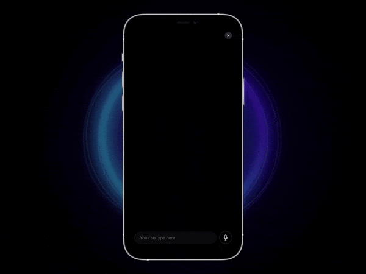

# Drouxy Assistant

This is a simple chatbot implementation, the goal is to give a model to those who want to get started or get inspired.

Demo:

Souce: [link](https://dribbble.com/shots/14782390-Meet-Chatbot-Elwa-powered-by-ui42)

## Get Started

### **Requirements**
Here are the tools you should have on your local or remote computer to get started.
- [NodeJS](https://nodejs.org)
- [PNPM](https://pnpm.io/)
- [Python](https://www.python.org/)
- [Poetry](https://python-poetry.org/)
- [Docker](https://www.docker.com/) - Optional (used for text to speech and speech to text) 

### **Installation** (test)

Before starting the installation, you can take a look at `.env` file

Commands: 

- `make install` - (Install project dependencies)
- `make install-speech` - Install docker services for tts (text to speech) and stt (speech to text)
- `pnpm run preview:all` - start the chatbot server on http://localhost:4173

> If you don't have make on your OS, you can check the `Makefile` and run these commands manually

## Models

In fact, there is no machine learning process to automate the conversations, instead we used a simple dataset with some conditions to make the current state more interesting, you can check that here `packages/server/mock/mock_dialog.py`

Sample Dataset
- French Language (`mock/dialogs_fr.json`)
- English Language (`mock/dialogs_en.json`)

## Extend

You can extend this project on your side to make it more interesting with any machine learning framework or other. here are a few if you are interested

- ### [wit.ai](https://wit.ai/): Wit.ai makes it easy for developers to build applications and devices that you can talk or text to.

- ### [Rasa](https://rasa.com/open-source/): Rasa Open Source supplies the building blocks for creating virtual assistants. Use Rasa to automate human-to-computer interactions anywhere from websites to social media platforms.
